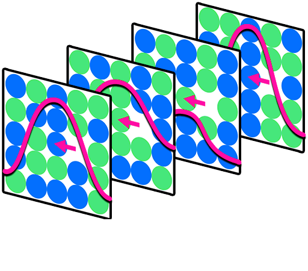

# Hop-Decorate (HopDec)

A high-throughput molecular dynamics workflow for generating atomistic databases of defect transport in chemically complex materials.

---

## Table of Contents

- [Description](#description)
- [Installation](#installation)
- [Configuration](#configuration)
- [Usage](#usage)
  - [Command-line mode](#command-line-mode)
  - [Interactive mode](#interactive-mode)
- [How it works](#how-it-works)
- [Examples](#examples)
- [Testing](#testing)
- [Known limitations](#known-limitations)
- [License & Copyright](#license)

---

## Description

**Hop-Decorate (HopDec)** is a Python-based automation framework for generating and analyzing defect transport processes in disordered or chemically complex materials (CCMs). It enables high-throughput exploration of migration pathways and kinetic barriers by integrating:

- Molecular dynamics (MD) event detection at user-defined temperature
- Dimer saddle-point searches for transition discovery
- Nudged Elastic Band (NEB) energy barrier calculations via ASE + LAMMPS
- Automated defect transition graph construction
- Local chemical redecoration for distribution-based kinetic sampling

HopDec is particularly useful for generating data-driven surrogate models or inputs for kinetic Monte Carlo (kMC) simulations in systems where chemical disorder (e.g., alloys or doped oxides) plays a significant role in defect dynamics.

---

## Installation

### Requirements

HopDec requires a working LAMMPS build with the Python interface enabled, and OpenMPI for parallel execution.

- [LAMMPS](https://www.lammps.org) — compiled with `python` and `manybody` packages
- [OpenMPI](https://www.open-mpi.org)

The Python dependencies are installed automatically by pip:

```
numpy  scipy  matplotlib  networkx  ase  pandas  mpi4py
```

### Install

We recommend managing your environment with [Conda](https://docs.conda.io/en/latest/):

```bash
conda create -n hopdec python=3.11
conda activate hopdec
conda install -c conda-forge mpi4py openmpi
pip install ase   # conda ASE can conflict with mpi4py on some platforms
```

Then install HopDec itself:

```bash
git clone https://github.com/your-org/Hop-Decorate.git
cd Hop-Decorate
pip install .
```

This installs the `hopdec` command-line entry point and all Python dependencies.

---

## Configuration

All run-time settings are controlled by a single XML file called `HopDec-config.xml` placed in your working directory. Key sections:

| Section | Key parameters |
|---------|---------------|
| **Main** | `inputFilename`, `maxModelDepth`, `canonicalLabelling`, `modelSearch`, `redecorateTransitions` |
| **LAMMPS** | `LAMMPSInitScript` (mass, pair_style, pair_coeff), `NSpecies`, `specieNamesString` |
| **MD** | `MDTemperature`, `MDTimestep`, `segmentLength`, `eventDisplacement` |
| **Defect detection** | `centroN`, `centroCutoff`, `bondCutoff` |
| **NEB** | `NEBNodes`, `NEBForceTolerance`, `NEBMaxIterations`, `NEBSpringConstant` |
| **Redecoration** | `activeSpeciesString`, `concentrationString`, `nDecorations`, `randomSeed` |
| **Minimization** | `minimizationForceTolerance`, `minimizationMaxSteps`, `maxMoveMin` |

Annotated template configs for several material systems are provided in `examples/`.

---

## Usage

### Command-line mode

The main workflow runs under MPI. From a directory containing your `HopDec-config.xml` and input structure:

```bash
mpirun -n <N> hopdec
```

Rank 0 owns the transition model and coordinates work; all other ranks run independent LAMMPS instances. A checkpoint file (`model-checkpoint_latest.pkl`) is written every `checkpointInterval` steps so runs can be resumed.

**Workflow controlled by two flags in the config:**

- `modelSearch 1` — discover new transitions via MD or Dimer, then compute NEB barriers
- `redecorateTransitions 1` — for known transitions, resample barriers across random chemical decorations

Both can be enabled simultaneously.

### Interactive mode

For scripted or notebook-based use, each module exposes a `main()` function:

```python
from HopDec.Input import getParams
from HopDec.State import read
import HopDec.NEB as NEB

params = getParams()          # reads HopDec-config.xml from CWD
initial = read("state1.dat")
final   = read("state2.dat")

connection = NEB.main(initial, final, params)
print(connection.transitions[0].forwardBarrier, "eV")
```

```python
import HopDec.Redecorate as Redecorate

# Resample barriers for a known transition under a new composition
Redecorate.main(transition, params)
```

See `examples/interactive-mode/` for Jupyter notebooks covering NEB, Dimer, MD event detection, and redecoration.

---

## How it works

### Transition discovery

1. An initial defect-containing structure is minimized with LAMMPS.
2. MD is run at `MDTemperature`; atom displacements are monitored each segment.
3. When an atom exceeds `eventDisplacement`, the run stops and the new state is minimized.
4. A centrosymmetry analysis identifies defect atoms in the new state.
5. NEB is run between initial and final states to compute the forward and reverse barriers.
6. The transition is added to the model graph (nodes = states, edges = transitions).
7. The process repeats from each newly discovered state up to `maxModelDepth`.

Alternatively, a **Dimer** saddle-point search can be used in place of MD for systems where thermal events are rare.

### Chemical redecoration

Given a transition, HopDec:

1. Takes the subset of atoms local to the defect (within `bondCutoff`).
2. Randomly reassigns species to `activeSpeciesString` atoms according to `concentrationString`.
3. Re-runs NEB for each decoration.
4. Accumulates a distribution of barriers and kinetic rates.

This efficiently samples the effect of local chemical disorder on defect migration without requiring a full alloy simulation for each decoration.

### State labelling

States are identified by graph hashes (Weisfeiler–Lehman on the defect sub-graph) so that structurally equivalent configurations found at different points in the simulation are recognised as the same state. Canonical labelling (`canonicalLabelling 1`) collapses symmetry-equivalent configurations; non-canonical labelling keeps them separate.

---

## Examples

| Directory | System | Demonstrates |
|-----------|--------|-------------|
| `examples/main-functionality/Zr/` | Pure Zr, vacancy | Full command-line run |
| `examples/main-functionality/CuNi/` | Cu-Ni alloy, vacancy | Model growth + redecoration |
| `examples/interactive-mode/neb/` | Cu-Ni double vacancy | NEB notebook |
| `examples/interactive-mode/dimer/` | — | Dimer saddle search notebook |
| `examples/interactive-mode/redecorate/` | — | Redecoration notebook |
| `examples/interactive-mode/md-to-barriers/` | — | Full MD→NEB pipeline notebook |

---

## Testing

The test suite requires no LAMMPS installation for the unit and I/O tests. LAMMPS-dependent tests skip automatically if the bindings are not available.

```bash
# From repo root or tests/ directory
pytest
```

```
255 passed, 12 skipped   (without LAMMPS)
267 passed               (with LAMMPS)
```

---

## Known limitations

- Input structures must have `[0, 0, 0]` as their origin.
- Atom IDs in input files must be consecutive.
- The MPI topology assumes one LAMMPS instance per rank; do not use LAMMPS-internal MPI parallelism alongside HopDec's rank decomposition.

## License

This program underwent formal release process with Los Alamos National Lab 
with reference number O4739

© 2024. Triad National Security, LLC. All rights reserved.
This program was produced under U.S. Government contract 89233218CNA000001 for Los Alamos National Laboratory (LANL), which is operated by Triad National Security, LLC for the U.S. Department of Energy/National Nuclear Security Administration. All rights in the program are reserved by Triad National Security, LLC, and the U.S. Department of Energy/National Nuclear Security Administration. The Government is granted for itself and others acting on its behalf a nonexclusive, paid-up, irrevocable worldwide license in this material to reproduce, prepare. derivative works, distribute copies to the public, perform publicly and display publicly, and to permit others to do so.

This program is Open-Source under the BSD-3 License.
 
Redistribution and use in source and binary forms, with or without modification, are permitted provided that the following conditions are met:
 
Redistributions of source code must retain the above copyright notice, this list of conditions and the following disclaimer.
 
Redistributions in binary form must reproduce the above copyright notice, this list of conditions and the following disclaimer in the documentation and/or other materials provided with the distribution.
 
Neither the name of the copyright holder nor the names of its contributors may be used to endorse or promote products derived from this software without specific prior written permission.

THIS SOFTWARE IS PROVIDED BY THE COPYRIGHT HOLDERS AND CONTRIBUTORS "AS IS" AND ANY EXPRESS OR IMPLIED WARRANTIES, INCLUDING, BUT NOT LIMITED TO, THE IMPLIED WARRANTIES OF MERCHANTABILITY AND FITNESS FOR A PARTICULAR PURPOSE ARE DISCLAIMED. IN NO EVENT SHALL THE COPYRIGHT HOLDER OR CONTRIBUTORS BE LIABLE FOR ANY DIRECT, INDIRECT, INCIDENTAL, SPECIAL, EXEMPLARY, OR CONSEQUENTIAL DAMAGES (INCLUDING, BUT NOT LIMITED TO, PROCUREMENT OF SUBSTITUTE GOODS OR SERVICES; LOSS OF USE, DATA, OR PROFITS; OR BUSINESS INTERRUPTION) HOWEVER CAUSED AND ON ANY THEORY OF LIABILITY, WHETHER IN CONTRACT, STRICT LIABILITY, OR TORT (INCLUDING NEGLIGENCE OR OTHERWISE) ARISING IN ANY WAY OUT OF THE USE OF THIS SOFTWARE, EVEN IF ADVISED OF THE POSSIBILITY OF SUCH DAMAGE.


